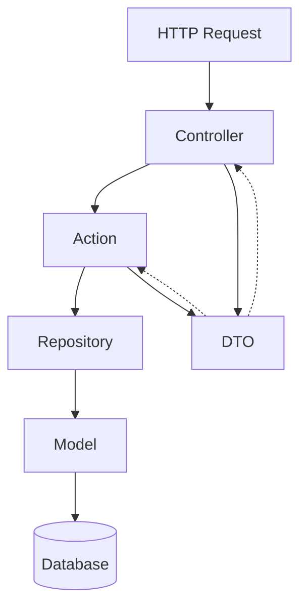

# ADR-002: Domain-Driven Design Approach

## Status

Accepted (2024-10-14)

## Context

Junction Bank is a personal finance management system with distinct business domains: Categories, Transactions, Months, Recurring Transactions, and Currency. The application needs a clear architectural pattern to:

1. Manage complexity as features grow
2. Maintain clear boundaries between domains
3. Enable independent domain evolution
4. Facilitate testing and maintenance
5. Support multiple developers working concurrently

Traditional MVC with "fat models" or "fat controllers" leads to:

-   Tight coupling between layers
-   Difficult testing
-   Unclear business logic location
-   Cross-cutting concerns mixed with domain logic
-   Hard-to-navigate codebases

## Decision

We will implement Domain-Driven Design (DDD) principles with the following structure:

### Domain Organization

```
app/Domains/{DomainName}/
├── Actions/              # Business logic (use cases)
├── DTOs/                 # Data transfer objects
├── Models/               # Eloquent models
├── Repositories/         # Data access layer
│   ├── {Name}Repository.php           (interface)
│   └── Eloquent{Name}Repository.php   (implementation)
└── Policies/             # Authorization rules
```

### Layer Responsibilities

**Controllers (HTTP Layer)**

-   HTTP request/response handling
-   Delegate to Actions
-   No business logic
-   Thin by design

**Actions (Business Logic Layer)**

-   Single responsibility use cases
-   Orchestrate business operations
-   Call repositories for data access
-   Return domain models or DTOs

**Repositories (Data Access Layer)**

-   Abstract data persistence
-   Hide Eloquent implementation details
-   Enable testing with mocks
-   Consistent query interface

**DTOs (Data Transfer Objects)**

-   Immutable data containers
-   Type-safe data transfer between layers
-   Validation at boundaries
-   Factory methods from various sources

**Models (Domain Models)**

-   Eloquent models
-   Stay within their domain
-   Relationships only within domain or via IDs
-   No cross-domain model imports

### Dependency Flow



### Key Principles

1. **Controllers delegate to Actions**

    - Controllers are thin
    - Business logic lives in Actions

2. **Actions contain business logic**

    - Single responsibility
    - Composable and testable
    - Orchestrate operations

3. **Repositories abstract data access**

    - Interface-based
    - Hide implementation details
    - Mockable for testing

4. **DTOs transfer data**

    - Immutable by design (readonly)
    - Type-safe
    - Validated at creation

5. **Domain isolation**
    - No cross-domain model imports
    - Use DTOs for inter-domain communication
    - Each domain is self-contained

## Consequences

### Positive

-   **Maintainability:** Clear separation of concerns makes code easier to understand and modify
-   **Testability:** Each layer can be tested independently with mocks
-   **Scalability:** Domains can evolve independently
-   **Onboarding:** New developers can understand domain boundaries quickly
-   **Code Quality:** Consistent patterns across all domains
-   **Refactoring:** Changes contained within layer boundaries
-   **Team Velocity:** Multiple developers can work on different domains without conflicts

### Negative

-   **Initial Overhead:** More files and structure than simple MVC
-   **Learning Curve:** Team must understand DDD principles
-   **Over-Engineering Risk:** Small features still require full structure
-   **Boilerplate:** More interfaces and classes to maintain

### Neutral

-   **File Count:** Higher number of smaller files vs. fewer larger files
-   **Directory Depth:** Deeper nesting vs. flat structure
-   **Abstractions:** More interfaces and contracts

## Alternatives Considered

### Alternative 1: Traditional Laravel MVC

**Description:** Standard Laravel structure with fat models or controllers

**Pros:**

-   Simpler initial setup
-   Less boilerplate
-   Familiar to Laravel developers
-   Quick for small features

**Cons:**

-   Logic becomes scattered
-   Tight coupling
-   Hard to test
-   Doesn't scale well
-   Cross-cutting concerns mixed in

**Why not chosen:** Won't scale as application grows. Multiple domains need clear boundaries.

### Alternative 2: Action-Domain-Responder (ADR)

**Description:** Refinement of MVC with Action classes and Responders

**Pros:**

-   Better than MVC
-   Actions are testable
-   Clear responsibility

**Cons:**

-   Less emphasis on domain boundaries
-   Still couples to HTTP concerns
-   No repository abstraction

**Why not chosen:** DDD provides better domain isolation and is more comprehensive.

### Alternative 3: Hexagonal/Ports & Adapters Architecture

**Description:** Full ports and adapters with application/infrastructure split

**Pros:**

-   Maximum flexibility
-   Complete isolation
-   Technology agnostic

**Cons:**

-   Much more complex
-   High overhead for web app
-   Over-engineered for current needs
-   Steep learning curve

**Why not chosen:** Too complex for a Laravel web application. DDD provides sufficient structure without excessive abstraction.

### Alternative 4: CQRS (Command Query Responsibility Segregation)

**Description:** Separate read and write operations with distinct models

**Pros:**

-   Optimized read/write paths
-   Scales well
-   Clear intent

**Cons:**

-   Adds significant complexity
-   Eventual consistency challenges
-   Overkill for current scale
-   Requires event sourcing infrastructure

**Why not chosen:** Premature optimization. Can be added later if needed.

## Implementation Guidelines

### Example: Create Category

**Controller:**

```php
public function store(CreateCategoryRequest $request): JsonResponse
{
    $category = $this->createCategory->execute(
        CategoryData::fromRequest($request)
    );

    return response()->json($category, 201);
}
```

**Action:**

```php
final class CreateCategoryAction
{
    public function __construct(
        private readonly CategoryRepository $repository
    ) {}

    public function execute(CategoryData $data): Category
    {
        return $this->repository->create($data);
    }
}
```

**Repository:**

```php
interface CategoryRepository
{
    public function create(CategoryData $data): Category;
}

final class EloquentCategoryRepository implements CategoryRepository
{
    public function create(CategoryData $data): Category
    {
        return Category::create([
            'name' => $data->name,
            'notes' => $data->notes,
        ]);
    }
}
```

**DTO:**

```php
final readonly class CategoryData
{
    public function __construct(
        public string $name,
        public string $type,
        public ?string $notes = null
    ) {}

    public static function fromRequest(Request $request): self
    {
        return new self(
            name: $request->string('name')->toString(),
            type: $request->string('type')->toString(),
            notes: $request->string('notes')->toString()
        );
    }
}
```

## Migration Path

For existing code not following DDD:

1. Extract business logic from controllers into Actions
2. Create DTOs for data transfer
3. Implement Repository interfaces
4. Update controllers to use Actions
5. Test each layer independently
6. Remove old controller logic

## Success Metrics

-   Controllers average < 10 lines per method
-   Actions have single responsibility
-   90%+ test coverage
-   No cross-domain model imports
-   New features follow pattern consistently

## References

-   [Development Rules: Domain-Driven Design](../rules/01-domain-driven-design.md)
-   [Development Rules: Repository Pattern](../rules/02-repository-pattern.md)
-   [CONTRIBUTING.md](../../CONTRIBUTING.md)
-   [Domain-Driven Design by Eric Evans](https://www.domainlanguage.com/ddd/)
-   [Laravel Beyond CRUD (Spatie)](https://laravel-beyond-crud.com/)
