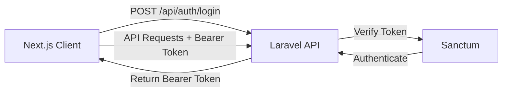

# ADR-003: Laravel Sanctum for API Authentication

## Status

Accepted (2024-10-14)

## Context

Junction Bank requires secure API authentication for:

-   Next.js frontend application
-   Potential mobile apps in future
-   Third-party API integrations
-   Multi-device access per user

The system currently uses Clerk for authentication, but we're migrating to a Laravel-native solution to:

1. Reduce external dependencies
2. Improve control over auth flow
3. Simplify deployment
4. Reduce costs
5. Enable self-hosting

### Requirements

-   Token-based authentication for SPA/API
-   Support for multiple devices per user
-   Token expiration and refresh
-   Secure token storage
-   Role-based authorization
-   API rate limiting
-   CSRF protection
-   Simple integration with Laravel

### Constraints

-   Must work with Next.js frontend
-   Must support future mobile apps
-   Should integrate with existing Laravel stack
-   Must be production-ready and well-maintained
-   Should not require complex infrastructure

## Decision

We will use **Laravel Sanctum** for API authentication.

### Implementation

**Token-based authentication:**

-   Bearer tokens for API requests
-   Separate tokens per device/session
-   Token abilities/scopes support
-   Personal access tokens

**Architecture:**



**Configuration:**

```php
// config/sanctum.php
'expiration' => 60 * 24 * 7, // 7 days
'middleware' => [
    'verify_csrf_token' => false, // SPA uses tokens
    'encrypt_cookies' => false,
],
```

**Authentication Flow:**

1. User registers/logs in with email/password
2. Server validates credentials
3. Server generates Sanctum token
4. Client stores token (httpOnly cookie or localStorage)
5. Client includes token in Authorization header
6. Server validates token on each request

**Endpoints:**

-   `POST /api/auth/register` - Register new user
-   `POST /api/auth/login` - Login and receive token
-   `POST /api/auth/logout` - Revoke current token
-   `GET /api/auth/me` - Get current user

**Middleware:**

```php
Route::middleware('auth:sanctum')->group(function () {
    // Protected routes
});
```

## Consequences

### Positive

-   **Laravel Native:** First-party package, well-maintained and documented
-   **Simple:** Minimal configuration, straightforward implementation
-   **Flexible:** Works with SPA, mobile, and API clients
-   **Secure:** Industry-standard token-based auth
-   **Multiple Tokens:** Per-device tokens with independent expiration
-   **Token Abilities:** Granular permissions per token
-   **Rate Limiting:** Built-in throttling support
-   **No Complex Infrastructure:** No OAuth server or JWT signing required
-   **Performance:** Fast token verification
-   **Cost:** Free, no external services
-   **Control:** Full ownership of auth system
-   **Privacy:** User data stays on our servers

### Negative

-   **Token Storage:** Client responsible for secure token storage
-   **Token Expiration:** Requires refresh token logic for long-lived sessions
-   **Revocation:** Requires database query to verify token not revoked
-   **No Built-in SSO:** Would need separate implementation
-   **Stateful:** Tokens stored in database (vs stateless JWT)

### Neutral

-   **Database Dependency:** Token verification requires DB lookup (mitigated by caching)
-   **Migration Required:** Must migrate from Clerk authentication
-   **Password Management:** Must implement password reset flow

## Alternatives Considered

### Alternative 1: Laravel Passport (OAuth2)

**Description:** Full OAuth2 server implementation

**Pros:**

-   Industry standard OAuth2
-   Supports multiple grant types
-   Built for third-party integrations
-   Access + refresh tokens
-   Scopes and abilities

**Cons:**

-   Overkill for SPA authentication
-   More complex setup and configuration
-   Heavier infrastructure
-   Longer tokens
-   More database tables
-   Not recommended by Laravel for simple API auth

**Why not chosen:** Sanctum is Laravel's recommendation for SPA/API auth. Passport is for OAuth server needs.

### Alternative 2: JWT with tymon/jwt-auth

**Description:** JSON Web Tokens with third-party package

**Pros:**

-   Stateless (no database lookup)
-   Self-contained tokens
-   Standard JWT format
-   Works across services

**Cons:**

-   Third-party package (less maintained)
-   Cannot revoke tokens before expiration
-   Token size larger
-   Secret key management critical
-   No per-device token tracking
-   Rotation complexity

**Why not chosen:** Sanctum provides better token management and is officially supported. Stateless tokens make revocation difficult.

### Alternative 3: Keep Clerk

**Description:** Continue using Clerk authentication service

**Pros:**

-   Already implemented
-   No migration needed
-   External service handles auth
-   Built-in UI components
-   Social login built-in

**Cons:**

-   External dependency
-   Cost scales with users
-   Less control over auth flow
-   Requires internet connectivity
-   Cannot self-host
-   Adds complexity to deployment
-   User data on external service

**Why not chosen:** Moving to Laravel-native auth reduces dependencies and costs, improves control.

### Alternative 4: Session-Based Auth

**Description:** Traditional Laravel session authentication

**Pros:**

-   Simple Laravel default
-   CSRF protection built-in
-   Well understood
-   No token management

**Cons:**

-   Not suitable for API/SPA
-   Requires cookies
-   CORS complications
-   Not mobile-friendly
-   Doesn't scale horizontally easily
-   State management complexity

**Why not chosen:** Not appropriate for API-first architecture with separate frontend.

### Alternative 5: Firebase Authentication

**Description:** Google Firebase Auth service

**Pros:**

-   Managed service
-   Social login built-in
-   Mobile SDKs
-   Real-time features

**Cons:**

-   External dependency
-   Vendor lock-in
-   Cost at scale
-   Requires Firebase account
-   Less Laravel integration
-   User data external

**Why not chosen:** Similar issues to Clerk - external dependency and lack of control.

## Implementation Strategy

### Phase 1: Setup Sanctum

-   Install Sanctum package
-   Run migrations
-   Configure sanctum.php
-   Setup middleware

### Phase 2: Auth Endpoints

-   Create AuthController
-   Implement register/login/logout
-   Add validation
-   Create tests

### Phase 3: Migrate from Clerk

-   Create user migration
-   Map Clerk users to Laravel users
-   Update frontend to use new auth
-   Remove Clerk dependency

### Phase 4: Enhanced Features

-   Add password reset
-   Implement email verification
-   Add two-factor authentication (optional)
-   Setup token expiration alerts

## Security Considerations

**Token Storage (Client):**

-   Use httpOnly cookies when possible
-   If localStorage, XSS protections critical
-   Never log tokens
-   Rotate tokens periodically

**Token Security (Server):**

-   Long random token generation
-   Hashed in database
-   HTTPS only in production
-   Rate limiting on auth endpoints
-   Brute force protection

**Password Security:**

-   Bcrypt hashing
-   Minimum length requirements
-   Common password blacklist
-   Password confirmation for sensitive actions

## Migration from Clerk

```php
// Migration strategy
1. Install Sanctum
2. Create auth endpoints
3. Dual authentication (Clerk + Sanctum) during migration
4. Migrate users from Clerk to Laravel
5. Update frontend to new endpoints
6. Remove Clerk when complete
```

## Testing Strategy

```php
// Feature tests
it('registers a new user', function () { ... });
it('logs in with valid credentials', function () { ... });
it('returns token on successful login', function () { ... });
it('fails with invalid credentials', function () { ... });
it('logs out and revokes token', function () { ... });
it('protects routes with auth:sanctum middleware', function () { ... });
```

## Performance Considerations

-   **Token Verification:** Requires DB lookup - cache heavily
-   **Redis Caching:** Cache valid tokens to reduce DB queries
-   **Token Cleanup:** Schedule job to delete expired tokens
-   **Rate Limiting:** Apply aggressive limits to auth endpoints

## References

-   [Laravel Sanctum Documentation](https://laravel.com/docs/sanctum)
-   [PRD-006: Security & Authentication Setup](../PRDs/PRD-006-security-authentication-setup.md)
-   [config/sanctum.php](../../config/sanctum.php)
-   [app/Models/User.php](../../app/Models/User.php)
