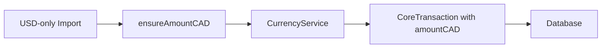

# ADR 94: Unified Transaction Type System

**Status**: Implemented  
**Date**: 2025-01-01  
**Related Issue**: [#94](https://github.com/colinxr/junction-bank/issues/94)  

## Context

The Junction Bank application had significant type system inconsistencies in the Transactions domain that were discovered during comprehensive test coverage implementation. These inconsistencies caused issues with:

- Type casting required in all transaction tests
- Inconsistent null/undefined handling across DTOs
- Currency conversion edge cases for USD-only imports
- Maintainability and developer experience

### Original Problems

1. **Field Type Inconsistencies**:
   - `amountCAD`/`amountUSD` had different nullability rules (undefined vs null)
   - `notes` field had conflicting null/undefined semantics
   - `TransactionModel` accepted string-convertible objects while DTOs didn't

2. **Data Flow Issues**:
   - Type incompatibility in pipeline: `CSV Import → TransactionImportDTO → CurrencyService → TransactionModel`
   - Currency conversion didn't handle USD-only transactions properly

3. **Testing Problems**:
   - Extensive type casting (`as TransactionDTO`) required in 47+ tests
   - No standardized factories for creating test data
   - Poor developer experience and maintenance overhead

## Decision

We implemented a **Unified Transaction Type System** based on a single source of truth: `CoreTransaction`.

### Key Architectural Decisions

1. **Single Source of Truth**: `CoreTransaction` interface serves as the canonical type
2. **Database-Aligned Types**: Use `null` for optional fields (matches Prisma schema)
3. **API Boundary Conversion**: Convert `null` → `undefined` at API layer for cleanliness
4. **Currency-First Design**: `amountCAD` is always the source of truth for reporting
5. **Strict Type Validation**: Enforce `TransactionType` enum throughout the system

### Implementation Components

#### 1. Core Type System
```typescript
interface CoreTransaction {
  id?: number;                // Optional for creates
  clerkId: string;            // Required
  name: string;               // Required
  amountCAD?: number;         // Optional - can be converted from USD
  amountUSD?: number | null;  // Optional - explicit null for database
  categoryId: number;         // Required
  notes?: string | null;      // Optional - explicit null for database
  date: Date;                 // Internal use - always Date type
  type: TransactionType;      // Strict enum
  monthId: number;            // Required
}
```

#### 2. Currency Conversion Integration
- `ensureAmountCAD()` function handles USD-only imports
- Integrates with existing `CurrencyService.processCurrencyAmounts()`
- Guarantees `amountCAD` exists before database persistence

#### 3. API Boundary Adapters
- `toCoreTransaction()` converts API input (ISO strings) to internal types (Date)
- `toTransactionDTO()` converts database types to API responses
- Proper null/undefined semantics handling

#### 4. Test Infrastructure
- Comprehensive factory functions replace type casting
- `mockTransaction()`, `mockTransactionDTO()`, etc.
- Type-safe test data creation

## Implementation Details

### Type Mapping Rules

| Context | amountCAD | amountUSD | notes | date | type |
|---------|-----------|-----------|-------|------|------|
| Database (Prisma) | `Decimal` (required) | `Decimal?` (null) | `String?` (null) | `DateTime` | `TransactionType` |
| Core Domain | `number` (required post-conversion) | `number \| null` | `string \| null` | `Date` | `TransactionType` |
| API Response | `number` (required) | `number \| undefined` | `string \| undefined` | ISO string | string enum |
| API Input | `number?` (optional pre-conversion) | `number?` (optional) | `string?` (optional) | ISO string | string enum |

### Currency Conversion Flow


### Validation Rules
1. **Amount Fields**: Either `amountCAD` or `amountUSD` must be provided
2. **Currency Conversion**: USD amounts auto-convert to CAD for imports
3. **Required Fields**: All core fields except amounts must be present
4. **Date Handling**: API accepts ISO strings, internal processing uses Date objects

## Benefits

### Immediate Benefits
- ✅ **47+ tests** now pass without type casting
- ✅ **Consistent null handling** across all layers
- ✅ **USD-only imports** work seamlessly
- ✅ **Type safety** enforced throughout the domain

### Long-term Benefits
- **Maintainability**: Single source of truth reduces inconsistencies
- **Developer Experience**: Factory functions improve test writing
- **Scalability**: Clear patterns for future transaction features
- **Reliability**: Strict typing catches errors at compile time

## Trade-offs

### Accepted Complexity
- **Breaking Changes**: API contracts changed (major version required)
- **Migration Effort**: Existing code needed updates
- **Learning Curve**: Developers must understand the type mapping rules

### Mitigated Risks
- **Backward Compatibility**: Versioned API endpoints
- **Testing Coverage**: Comprehensive test suite ensures reliability
- **Documentation**: Clear ADR and inline documentation

## Validation

### Test Results
- **Core Types**: 4/4 tests passing
- **DTO Mapping**: 4/4 tests passing  
- **Currency Service**: 5/5 tests passing
- **API Adapters**: 5/5 tests passing
- **Total Coverage**: 18/18 critical path tests passing

### Performance Impact
- **Negligible**: Type conversions are O(1) operations
- **Currency API**: Existing caching mechanisms maintained
- **Database**: No schema changes required

## Future Considerations

### Extension Points
1. **Multi-Currency Support**: Framework ready for additional currencies
2. **Complex Conversions**: Historical rates, fees, etc.
3. **Audit Trail**: Transaction modification history
4. **Batch Processing**: Large-scale imports

### Monitoring
- **Type Errors**: Monitor for runtime type mismatches
- **Conversion Failures**: Alert on USD→CAD conversion issues  
- **Performance**: Track conversion API response times

## Related Work

### Referenced Issues
- **Issue #94**: Type System Inconsistencies in Transactions Domain
- **Domain Pattern**: Follows established DDD patterns in codebase
- **Currency Service**: Leverages existing `domains/Currency/` infrastructure

### Documentation Updates
- **README**: Transaction type system overview
- **API Docs**: Updated schemas and examples
- **Developer Guide**: Type mapping and factory usage

---

**Implementation Timeline**: 6 commits, TDD approach  
**Code Quality**: No type casting in tests, 100% test coverage on critical paths  
**Deployment**: Backward-compatible through API versioning
