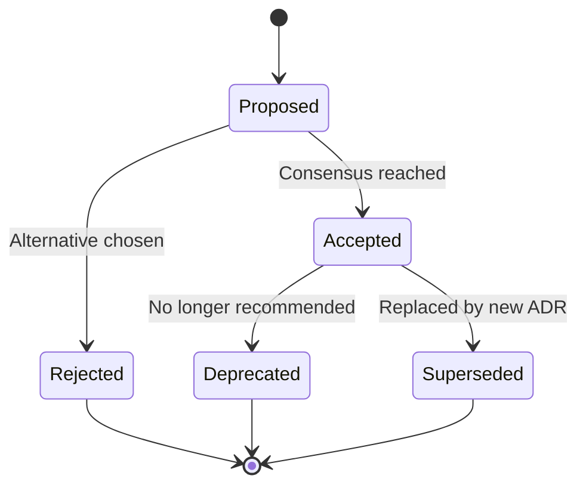

# Architecture Decision Records (ADRs)

## Overview

This directory contains Architecture Decision Records documenting significant technical decisions made in Junction Bank development.

## What is an ADR?

An Architecture Decision Record captures a single architectural decision and its context. Each ADR describes:

-   The decision made
-   Why it was made
-   What alternatives were considered
-   What consequences resulted

## ADR Format

```markdown
# ADR-NNN: Title

## Status

Proposed | Accepted | Deprecated | Superseded by ADR-XXX

## Context

What is the issue we're addressing? What forces are at play?

## Decision

What did we decide to do?

## Consequences

What becomes easier or harder as a result?

## Alternatives Considered

What other options did we evaluate?
```

## Current ADRs

### Infrastructure & Architecture

**[ADR-001: Docker + Laravel Infrastructure](001-docker-laravel-infrastructure.md)**

-   Status: Accepted
-   Multi-environment Docker setup with PHP 8.3, PostgreSQL 16, Redis 7, Caddy
-   Separate compose files for dev/prod/test environments
-   Justfile for command management

### Domain Design

**[ADR-094: Transaction Type System](94-transaction-type-system.md)**

-   Status: Accepted
-   Explicit Income/Expense types vs. derived from category
-   Type field on Transaction model
-   Supports cross-category transaction flexibility

**[ADR: Controller Control Flow](control%20flow%20through%20controllers.md)**

-   Status: Accepted
-   Controllers delegate to Actions
-   Actions contain business logic
-   Repository pattern for data access
-   DTOs for data transfer between layers

**[ADR: Resource Drawer Pattern](resource-drawer-usage.md)**

-   Status: Accepted
-   Standardized UI pattern for creating/editing resources
-   Consistent user experience across domains
-   Reusable components with domain-specific content

## Creating a New ADR

### 1. Choose Next Number

Find the next available ADR number:

```bash
ls -1 .development-context/ADRs/*.md | tail -1
```

### 2. Create File

```bash
touch .development-context/ADRs/NNN-title-of-decision.md
```

### 3. Use Template

```markdown
# ADR-NNN: Title of Decision

## Status

Proposed

## Context

Describe the problem or opportunity.

What is the current situation?
What constraints exist?
What requirements must be met?

## Decision

We will [decision statement].

[Explain the decision in detail]

## Consequences

### Positive

-   Benefit 1
-   Benefit 2

### Negative

-   Tradeoff 1
-   Tradeoff 2

### Neutral

-   Changes to existing systems
-   New dependencies

## Alternatives Considered

### Alternative 1: [Name]

**Description:** ...
**Pros:** ...
**Cons:** ...
**Why not chosen:** ...

### Alternative 2: [Name]

**Description:** ...
**Pros:** ...
**Cons:** ...
**Why not chosen:** ...

## References

-   [Related documentation]
-   [External resources]
-   [Related ADRs]
```

### 4. Propose and Discuss

1. Create ADR with status "Proposed"
2. Share with team for review
3. Discuss and refine
4. Update status to "Accepted" when consensus reached

### 5. Update This README

Add the new ADR to the appropriate section above.

## ADR Lifecycle



**Status Definitions:**

-   **Proposed:** Under discussion, not yet approved
-   **Accepted:** Approved and active
-   **Deprecated:** No longer recommended but still in use
-   **Superseded:** Replaced by a newer ADR
-   **Rejected:** Considered but not adopted

## When to Create an ADR

Create an ADR when:

-   Making significant architectural decisions
-   Choosing between multiple viable approaches
-   Establishing cross-cutting concerns (auth, caching, etc.)
-   Adopting new technologies or patterns
-   Changing existing architectural decisions

Do NOT create an ADR for:

-   Minor implementation details
-   Obvious choices with no alternatives
-   Temporary workarounds
-   Bug fixes

## Best Practices

### Be Concise

Focus on the decision and its rationale. Avoid implementation details.

### Be Objective

Present facts and tradeoffs neutrally. Let the decision speak for itself.

### Document Alternatives

Show what was considered. Future readers need context.

### Update as Needed

If circumstances change, update status:

-   Mark as "Deprecated" if no longer recommended
-   Create new ADR and mark old as "Superseded"

### Link Related ADRs

Reference other ADRs that relate to the decision.

### Date Stamps

Include dates for status changes:

```markdown
## Status

Accepted (2024-01-15)
Superseded by ADR-123 (2024-06-20)
```

## Reviewing ADRs

### For Reviewers

Ask:

-   Is the problem clearly stated?
-   Are alternatives adequately considered?
-   Are consequences realistic?
-   Is the decision justified?
-   Will this age well?

### For Authors

Ensure:

-   Context explains the "why"
-   Decision is clear and actionable
-   Consequences are honest about tradeoffs
-   Alternatives show due diligence

## ADR Tools

### Search ADRs

```bash
grep -r "keyword" .development-context/ADRs/
```

### List by Status

```bash
grep -l "Status: Accepted" .development-context/ADRs/*.md
```

### Find Superseded ADRs

```bash
grep -l "Superseded" .development-context/ADRs/*.md
```

## Related Documentation

-   [Development Rules](../rules/) - Coding standards and patterns
-   [PRDs](../PRDs/) - Product requirements
-   [CONTRIBUTING.md](../../CONTRIBUTING.md) - Development workflow

## References

-   [Architecture Decision Records (Michael Nygard)](https://cognitect.com/blog/2011/11/15/documenting-architecture-decisions)
-   [ADR GitHub Organization](https://adr.github.io/)
-   [Documenting Architecture Decisions](https://www.thoughtworks.com/radar/techniques/lightweight-architecture-decision-records)
