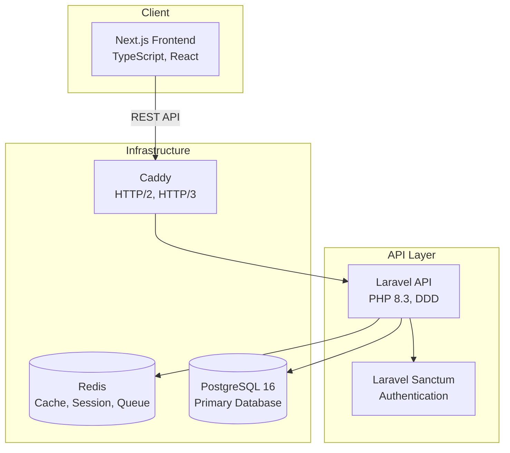

# Junction Bank

Domain-driven personal finance management system built with Laravel, Next.js, and PostgreSQL.

## Architecture



## System Requirements

-   Docker Desktop 4.0+
-   Just (command runner)
-   Git

## Quick Start

```bash
# Clone repository
git clone <repository-url>
cd junction-bank

# Initial setup
just setup

# Access application
open http://localhost:8000
```

## Project Structure

```
junction-bank/
├── app/                          # Laravel application
│   ├── Domains/                  # Domain-driven design modules
│   │   └── Categories/
│   │       ├── Actions/          # Business logic
│   │       ├── DTOs/             # Data transfer objects
│   │       ├── Models/           # Eloquent models
│   │       └── Repositories/     # Data access layer
│   ├── Http/
│   │   ├── Controllers/          # HTTP controllers (thin)
│   │   └── Middleware/           # HTTP middleware
│   └── Policies/                 # Authorization policies
├── next-js-app/                  # Next.js frontend
│   ├── app/                      # App router pages
│   ├── components/               # React components
│   ├── domains/                  # Frontend domain logic
│   └── infrastructure/           # API clients, utils
├── docker/                       # Docker configuration
│   ├── php/                      # PHP-FPM images
│   ├── caddy/                    # Caddy config
│   ├── postgres/                 # PostgreSQL config
│   └── redis/                    # Redis config
├── .development-context/         # Development docs
│   ├── ADRs/                     # Architecture decisions
│   ├── PRDs/                     # Product requirements
│   └── rules/                    # Development rules
└── tests/                        # Test suite
```

## Development

### Essential Commands

```bash
# Environment management
just dev              # Start development environment
just dev-stop         # Stop development environment
just dev-logs         # View logs

# Application
just artisan [cmd]    # Run artisan command
just composer [cmd]   # Run composer command
just ssh              # SSH into PHP container

# Database
just migrate          # Run migrations
just migrate-fresh    # Fresh migration + seed
just seed             # Run seeders
just db-backup        # Backup database
just db-restore       # Restore latest backup
just psql             # PostgreSQL CLI

# Code quality
just phpstan          # Static analysis
just pint             # Code style check/fix
just test             # Run tests
just quality          # All quality checks

# Build
just build-dev        # Build dev images
just build-prod       # Build prod images
```

Full command reference: `just --list`

### Development Services

| Service         | URL                   | Purpose              |
| --------------- | --------------------- | -------------------- |
| Application     | http://localhost:8000 | Main Laravel API     |
| Next.js         | http://localhost:3000 | Frontend application |
| Vite Dev Server | http://localhost:5173 | Hot module reload    |
| Adminer         | http://localhost:8080 | Database management  |
| MailHog         | http://localhost:8025 | Email testing        |
| Redis Commander | http://localhost:8081 | Redis management     |

### Environment Configuration

1. Copy `.env.example` to `.env`
2. Configure essential variables:

```env
APP_NAME="Junction Bank"
APP_ENV=local
APP_DEBUG=true

DB_CONNECTION=pgsql
DB_HOST=postgres
DB_DATABASE=junction_bank

REDIS_HOST=redis
CACHE_DRIVER=redis
SESSION_DRIVER=redis
QUEUE_CONNECTION=redis
```

### Domain-Driven Design

Junction Bank follows DDD principles. Each domain is self-contained:

```
app/Domains/{DomainName}/
├── Actions/              # Business logic (use cases)
├── DTOs/                 # Data transfer objects
├── Models/               # Eloquent models
├── Repositories/         # Data access abstraction
└── Policies/             # Authorization rules
```

**Key Principles:**

-   Controllers delegate to Actions
-   Actions contain business logic
-   Repositories abstract data access
-   DTOs transfer data between layers
-   Models stay in their domain

See: [.development-context/rules/](.development-context/rules/) for complete guidelines.

## Testing

```bash
# Run all tests
just test

# Run specific test suites
just test-pest          # Pest PHP tests
just test-arch          # Architecture tests

# Code quality
just phpstan            # Static analysis
just pint-test          # Style check without fixing
```

### Test Structure

```bash
tests/
├── Feature/            # Integration tests
├── Unit/               # Unit tests
└── Architecture/       # Architecture constraints
```

## API Documentation

API documentation available at `/api/documentation` when running in development mode.

See: [.development-context/api-endpoints-reference.md](.development-context/api-endpoints-reference.md)

## Architecture Decisions

Key architectural decisions documented in [.development-context/ADRs/](.development-context/ADRs/):

-   [Docker + Laravel Infrastructure](/.development-context/ADRs/001-docker-laravel-infrastructure.md)
-   [Transaction Type System](/.development-context/ADRs/94-transaction-type-system.md)
-   [Controller Control Flow](/.development-context/ADRs/control%20flow%20through%20controllers.md)
-   [Resource Drawer Pattern](/.development-context/ADRs/resource-drawer-usage.md)

## Troubleshooting

### Common Issues

**Container won't start:**

```bash
just dev-logs           # Check logs
just health             # Service status
just clean && just setup # Nuclear option
```

**Permission errors:**

```bash
echo "USER_ID=$(id -u)" >> .env
echo "GROUP_ID=$(id -g)" >> .env
just build-dev
```

**Database connection:**

```bash
just psql               # Test connection
just migrate-fresh      # Reset database
```

**Cache issues:**

```bash
just artisan cache:clear
just artisan config:clear
just artisan route:clear
just artisan view:clear
```

Complete troubleshooting: [docker/README.md](docker/README.md)

## Production Deployment

```bash
# Build production images
just build-prod

# Deploy
just prod

# Run migrations
docker compose -f compose.yml -f compose.prod.yml exec php php artisan migrate --force
```

Production configuration includes:

-   Read-only filesystem
-   OPcache with JIT
-   Resource limits
-   Security hardening
-   Automated backups

See: [docker/README.md](docker/README.md) for complete deployment guide.

## Contributing

See [CONTRIBUTING.md](CONTRIBUTING.md) for development workflow and guidelines.

## Security

-   Laravel Sanctum for API authentication
-   Security headers middleware
-   CORS configuration
-   Rate limiting
-   SQL injection protection (PDO)
-   XSS protection (Blade escaping)

Security issues: Create a private security advisory.

## Performance

-   PostgreSQL 16 with query optimization
-   Redis for caching, sessions, queues
-   OPcache with JIT (production)
-   HTTP/2 and HTTP/3 support
-   Asset compilation and minification

## License

Proprietary. All rights reserved.

## Support

1. Check [docker/README.md](docker/README.md)
2. Review [.development-context/](.development-context/)
3. Run `just health` for diagnostics
4. Check `storage/logs/` for application logs
