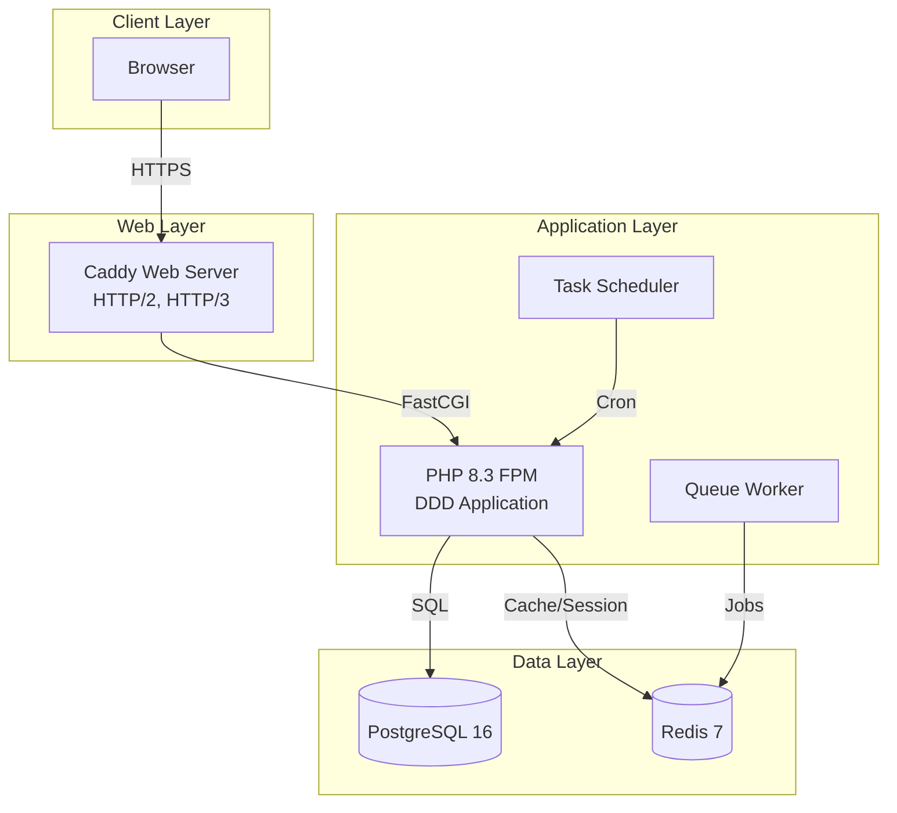

# Docker Infrastructure

Multi-environment Docker setup for Junction Bank following DDD principles.

## Architecture



## Environments

### Development (`compose.dev.yml`)

- Xdebug enabled
- Hot reload
- Development tools (MailHog, PgAdmin, Redis Commander)
- Verbose logging
- Exposed database ports

### Production (`compose.prod.yml`)

- Multi-stage optimized builds
- Read-only filesystems
- Security hardening
- Resource limits
- No exposed database ports
- Automated backups

### Testing (`compose.test.yml`)

- Isolated test database
- In-memory storage (tmpfs)
- Parallel test execution
- Code coverage
- Static analysis tools

## Services

### PHP-FPM

- **Image**: php:8.3-fpm-alpine
- **Extensions**: PDO, PostgreSQL, Redis, GD, Intl, OPcache
- **Development**: Xdebug 3.x
- **Production**: JIT compilation, OPcache optimization
- **Security**: Non-root user, read-only filesystem (prod)

### Caddy

- **Version**: 2.x
- **Features**: HTTP/2, HTTP/3, automatic HTTPS
- **Configuration**: Optimized for Laravel
- **Security**: Security headers, hidden server info

### PostgreSQL

- **Version**: 16-alpine
- **Extensions**: uuid-ossp, pg_trgm, pg_stat_statements
- **Tuning**: Production-optimized settings
- **Backup**: Automated daily backups (prod)

### Redis

- **Version**: 7-alpine
- **Persistence**: RDB + AOF
- **Configuration**: LRU eviction, optimized for cache/session
- **Memory**: 256MB (dev), 512MB (prod)

## Usage

### Development

```bash
# Start
just dev

# Stop
just dev-stop

# View logs
just dev-logs

# Execute Artisan
just artisan migrate

# Execute Composer
just composer install

# SSH into container
just ssh
```

### Production

```bash
# Start
just prod

# Stop
just prod-stop

# View logs
just prod-logs
```

### Testing

```bash
# Run all tests
just test

# PHPUnit with coverage
just test-phpunit

# Static analysis
just test-phpstan

# Code style check
just test-cs

# Architecture tests
just test-arch
```

## File Structure

```
docker/
├── php/
│   ├── Dockerfile.dev       # Development image with Xdebug
│   ├── Dockerfile.prod      # Production image (multi-stage)
│   ├── php-dev.ini          # Development PHP config
│   └── php-prod.ini         # Production PHP config (JIT, OPcache)
├── caddy/
│   └── Caddyfile            # Caddy web server config
├── postgres/
│   ├── init-scripts/
│   │   └── 01-init.sql      # Database initialization
│   └── backups/             # Database backups
└── redis/
    └── redis.conf           # Redis configuration

compose.yml              # Base configuration
compose.dev.yml          # Development overrides
compose.prod.yml         # Production overrides
compose.test.yml         # Testing overrides
```

## Volumes

### Development

- `./app` - Application code (cached)
- `php_storage` - Laravel storage
- `php_cache` - Laravel cache
- `postgres_data` - Database data
- `redis_data` - Redis persistence
- `composer_cache` - Composer packages

### Production

- `./app:ro` - Application code (read-only)
- Named volumes for all persistent data
- tmpfs for temporary files

## Health Checks

All services include health checks:

- **PHP-FPM**: `php-fpm -t`
- **Caddy**: HTTP request to `/api/health`
- **PostgreSQL**: `pg_isready`
- **Redis**: `redis-cli ping`

## Security Features

### Development

- Non-root user execution
- Environment variable isolation
- Docker network isolation

### Production

- Read-only root filesystem
- Minimal capabilities (CAP_DROP all, CAP_ADD selective)
- Security options (no-new-privileges)
- Resource limits (CPU, memory)
- No exposed database ports
- SCRAM-SHA-256 authentication
- Password-protected Redis
- Security headers in Caddy

## Performance Tuning

### PHP

- OPcache with JIT (prod)
- 256MB OPcache memory
- Preloading support
- Session storage in Redis

### PostgreSQL

- Shared buffers: 256MB (dev), 512MB (prod)
- Effective cache: 1GB (dev), 2GB (prod)
- WAL optimization
- Parallel query execution (prod)

### Redis

- LRU eviction policy
- AOF + RDB persistence
- Lazy freeing
- Optimized for cache patterns

## Troubleshooting

### Container won't start

```bash
# Check logs
docker compose -f compose.yml -f compose.dev.yml logs

# Check health status
docker compose -f compose.yml -f compose.dev.yml ps
```

### Database connection issues

```bash
# Verify PostgreSQL is healthy
docker compose -f compose.yml -f compose.dev.yml exec postgres pg_isready

# Check connection from PHP
docker compose -f compose.yml -f compose.dev.yml exec php php artisan tinker
```

### Permission issues

```bash
# Set correct USER_ID and GROUP_ID in .env
echo "USER_ID=$(id -u)" >> .env
echo "GROUP_ID=$(id -g)" >> .env

# Rebuild
just build-dev
```

### Clear everything and start fresh

```bash
just clean
just setup
```

## Monitoring

### Development Tools

- **MailHog**: http://localhost:8025
- **PgAdmin**: http://localhost:5050
- **Redis Commander**: http://localhost:8081

### Logs

```bash
# All services
just dev-logs

# Specific service
just dev-logs php
just dev-logs postgres
```

### Resource Usage

```bash
docker stats
```

## Backup & Restore

### Backup

```bash
just db-backup
```

### Restore

```bash
just db-restore
```

## CI/CD Integration

The test environment is designed for CI/CD:

```bash
# Run in CI pipeline
docker compose -f compose.yml -f compose.test.yml up --abort-on-container-exit
EXIT_CODE=$?
docker compose -f compose.yml -f compose.test.yml down -v
exit $EXIT_CODE
```

## Maintenance

### Update Images

```bash
# Pull latest base images
docker compose -f compose.yml -f compose.dev.yml pull

# Rebuild
just build-dev
```

### Clean Docker System

```bash
# Remove unused images, containers, volumes
just clean-docker
```

## Production Deployment

1. **Build production images**

   ```bash
   just build-prod
   ```

2. **Configure environment**

   ```bash
   cp .env.example .env.production
   # Edit .env.production with production values
   ```

3. **Deploy**

   ```bash
   docker compose -f compose.yml -f compose.prod.yml up -d
   ```

4. **Run migrations**

   ```bash
   docker compose -f compose.yml -f compose.prod.yml exec php php artisan migrate --force
   ```

5. **Monitor**
   ```bash
   just prod-logs
   ```

## Support

For issues or questions:

1. Check logs: `just dev-logs`
2. Verify health: `just health`
3. Review this documentation
4. Check Laravel logs in `storage/logs/`
